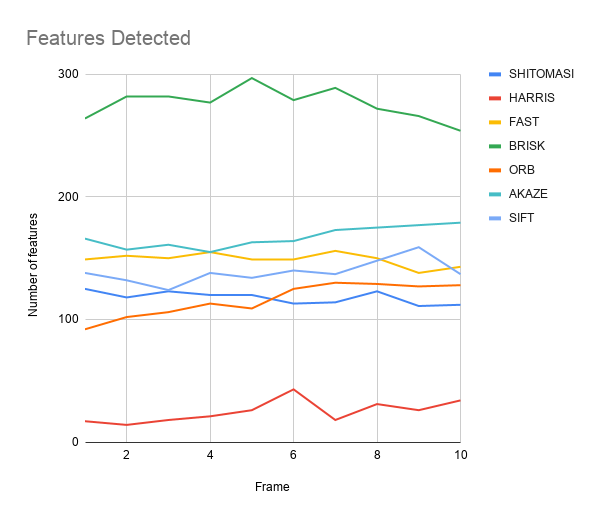
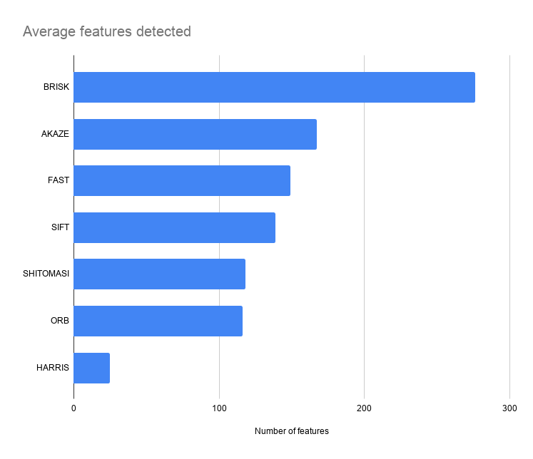
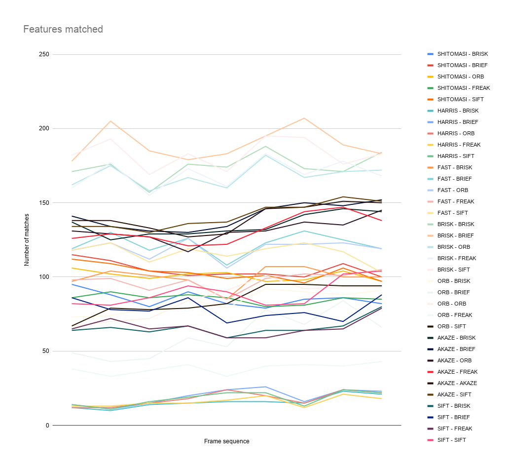
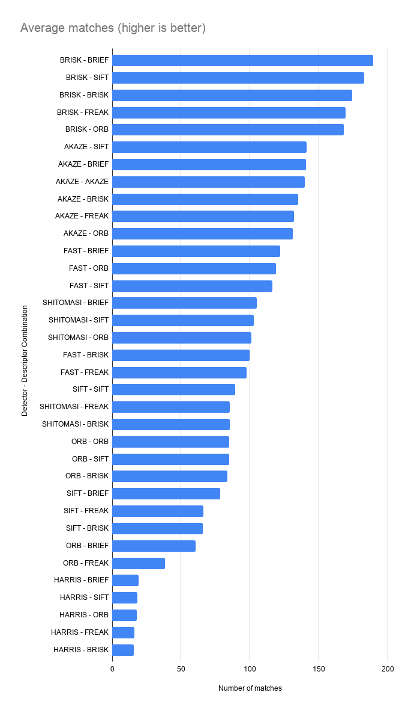
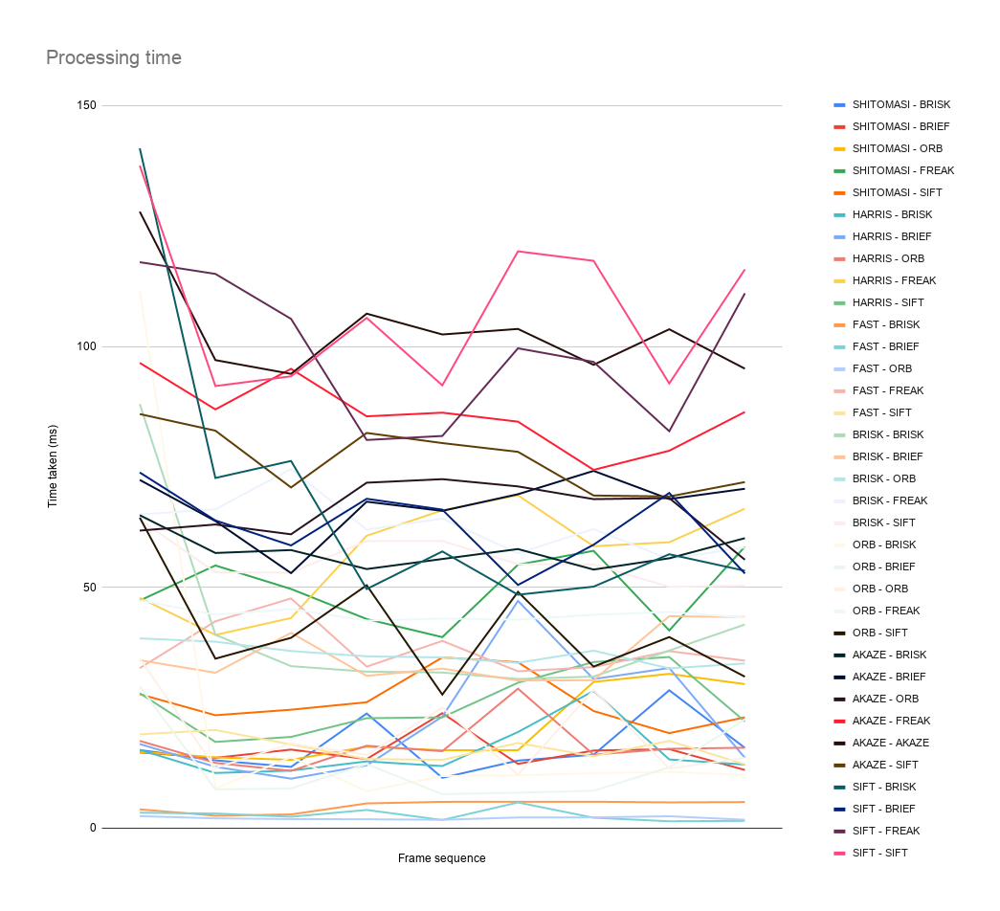
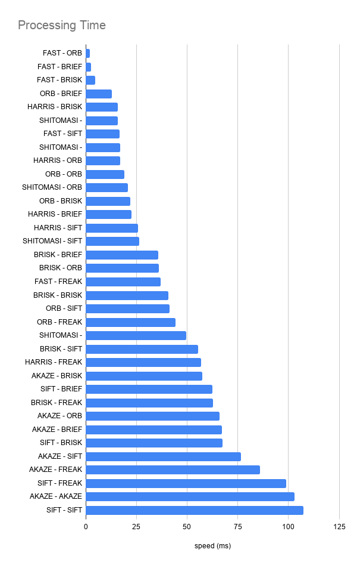
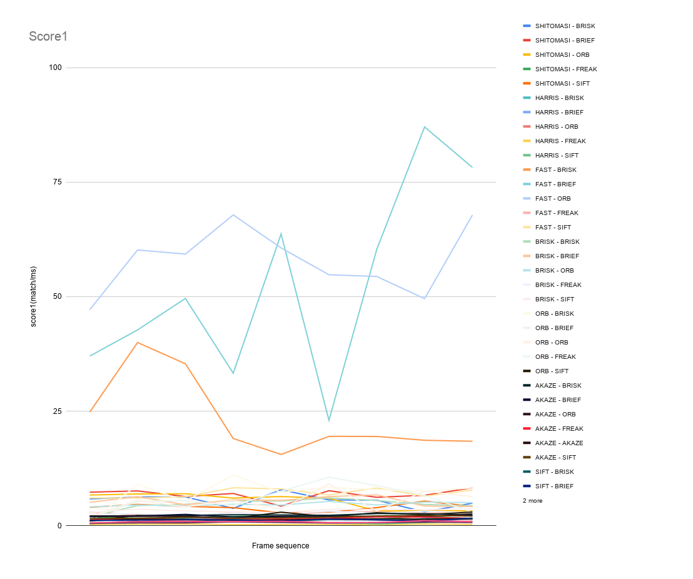
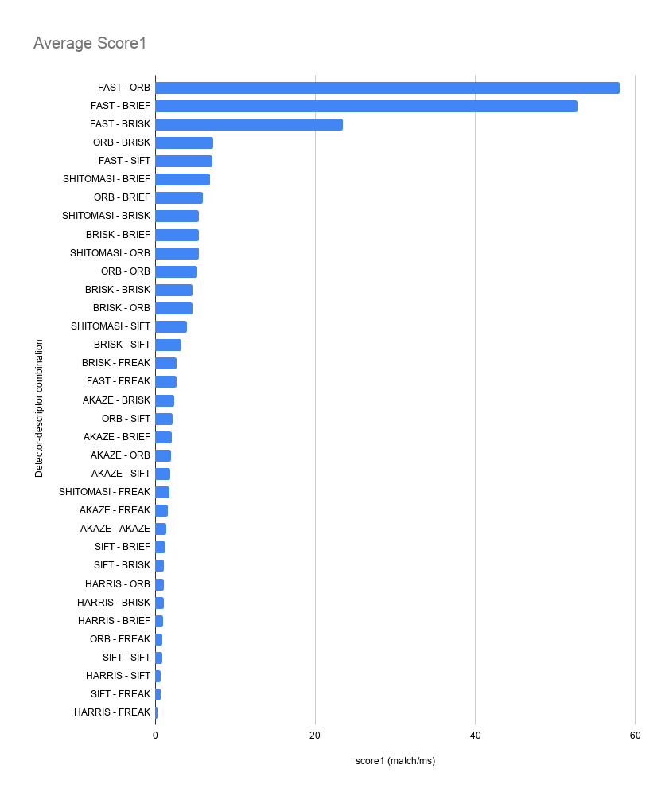
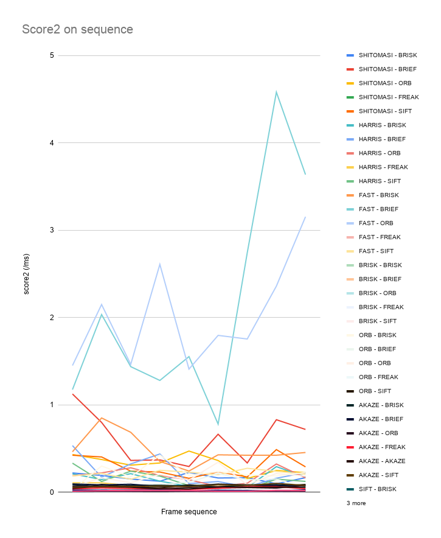
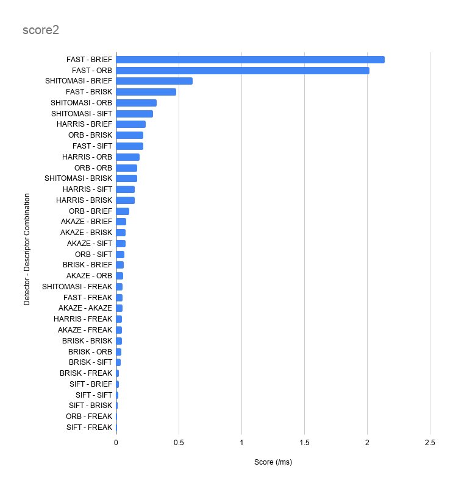

# SFND 2D Feature Tracking


## MP.1 Data Buffer Optimization
Implemented a vector for dataBuffer objects whose size does not exceed a limit (e.g. 2 elements). This is achieved by pushing in new elements on one end and removing elements on the other end.

```cpp
// push image into data frame buffer
if(dataBuffer.size() == dataBufferSize)
{
    dataBuffer.erase(dataBuffer.begin());
}
DataFrame frame;
frame.cameraImg = imgGray;
dataBuffer.push_back(frame);
```

## MP.2 Keypoint Detection

Implemented detectors HARRIS, FAST, BRISK, ORB, AKAZE, and SIFT. They can be selected by setting a string on line 78 in `src/MidTermProject_Camera_Student.cpp`

```cpp
/* DETECT IMAGE KEYPOINTS */

// extract 2D keypoints from current image
vector<cv::KeyPoint> keypoints; // create empty feature list for current image
string detectorType = "SIFT";
```

## MP.3 Keypoint Removal

Removed all keypoints outside of a pre-defined rectangle by using OpenCV's `cv::Rect2i::contains(const cv::Point2i &pt)` function. Only points within this rectangle are used for further processing. This can be see in lines 118-136 in `src/MidTermProject_Camera_Student.cpp`
```cpp
// only keep keypoints on the preceding vehicle
bool bFocusOnVehicle = true;
cv::Rect vehicleRect(535, 180, 180, 150);
int numKeypointsOnVehicle = 0;
if (bFocusOnVehicle)
{

    for(auto itr = keypoints.begin(); itr != keypoints.end();)
    {
        if (!vehicleRect.contains(itr->pt))
            keypoints.erase(itr);
        else
        {
            ++itr;
            ++numKeypointsOnVehicle;
        } 
    }
    std::cout << numKeypointsOnVehicle << " keypoints have been found on the  preceding vehicle" << endl;
}
```

## MP.4 Keypoint Descriptors

Implemented descriptors BRIEF, ORB, FREAK, AKAZE and SIFT. These can be selected by setting the string on line 165 in `src/MidTermProject_Camera_Student.cpp`
```cpp
cv::Mat descriptors;
string descriptorType = "SIFT"; // BRIEF, ORB, FREAK, AKAZE, SIFT
descKeypoints((dataBuffer.end() - 1)->keypoints, (dataBuffer.end() - 1)->cameraImg, descriptors, descriptorType);
```

## MP.5 Descriptor Matching
Implemented BF and FLANN matching with k-nearest neighbor selection as done in the lesson quizzes. They can be selected by setting the string in lines 180-182 in `src/MidTermProject_Camera_Student.cpp`
```cpp
string matcherType = "MAT_BF";        // MAT_BF, MAT_FLANN
string descriptorType = "DES_HOG"; // DES_BINARY, DES_HOG
string selectorType = "SEL_KNN";       // SEL_NN, SEL_KNN
```

## MP.6 Descriptor Distance Ratio
Implemented Descriptor Distance Ratio in K-Nearest Neighbor matching with a minDescRatio of 0.8
```cpp
double minDescDistRatio = 0.8;
for(auto itr=knn_matches.begin(); itr!=knn_matches.end(); ++itr)
{
    if((*itr)[0].distance < minDescDistRatio*(*itr)[1].distance)
        matches.push_back((*itr)[0]);
}
```

## MP.7 Performance Evaluation 1

Count of number of keypoints on preceding vehicle

| Detector\Frame | 1   | 2   | 3   | 4   | 5   | 6   | 7   | 8   | 9   | 10  |
|----------------|-----|-----|-----|-----|-----|-----|-----|-----|-----|-----|
| SHITOMASI      | 125 | 118 | 123 | 120 | 120 | 113 | 114 | 123 | 111 | 112 |
| HARRIS         | 17  | 14  | 18  | 21  | 26  | 43  | 18  | 31  | 26  | 34  |
| FAST           | 149 | 152 | 150 | 155 | 149 | 149 | 156 | 150 | 138 | 143 |
| BRISK          | 264 | 282 | 282 | 277 | 297 | 279 | 289 | 272 | 266 | 254 |
| ORB            | 92  | 102 | 106 | 113 | 109 | 125 | 130 | 129 | 127 | 128 |
| AKAZE          | 166 | 157 | 161 | 155 | 163 | 164 | 173 | 175 | 177 | 179 |
| SIFT           | 138 | 132 | 124 | 138 | 134 | 140 | 137 | 148 | 159 | 137 |





## MP.8 Performance Evaluation 2
Count of the number of matched keypoints for all 10 images using all possible combinations of detectors and descriptors. In the matching step, the BF approach is used with the descriptor distance ratio set to 0.8.

| Combination\Frame seq.       | 1-2 | 2-3 | 3-4 | 4-5 | 5-6 | 6-7 | 7-8 | 8-9 | 9-10 |
|-------------------|-----|-----|-----|-----|-----|-----|-----|-----|------|
| SHITOMASI - BRISK | 95  | 88  | 80  | 90  | 82  | 79  | 85  | 86  | 82   |
| SHITOMASI - BRIEF | 115 | 111 | 104 | 101 | 102 | 102 | 100 | 109 | 100  |
| SHITOMASI - ORB   | 106 | 102 | 99  | 102 | 103 | 97  | 98  | 104 | 97   |
| SHITOMASI - FREAK | 86  | 90  | 86  | 88  | 86  | 80  | 81  | 86  | 85   |
| SHITOMASI - AKAZE | N/A | N/A | N/A | N/A | N/A | N/A | N/A | N/A | N/A  |
| SHITOMASI - SIFT  | 112 | 109 | 104 | 103 | 99  | 101 | 96  | 106 | 97   |
| HARRIS - BRISK    | 12  | 10  | 14  | 15  | 16  | 16  | 15  | 23  | 21   |
| HARRIS - BRIEF    | 14  | 11  | 15  | 20  | 24  | 26  | 16  | 24  | 23   |
| HARRIS - ORB      | 12  | 12  | 15  | 18  | 24  | 20  | 15  | 24  | 22   |
| HARRIS - FREAK    | 13  | 13  | 15  | 15  | 17  | 20  | 12  | 21  | 18   |
| HARRIS- AKAZE     | N/A | N/A | N/A | N/A | N/A | N/A | N/A | N/A | N/A  |
| HARRIS - SIFT     | 14  | 11  | 16  | 19  | 22  | 22  | 13  | 24  | 22   |
| FAST - BRISK      | 97  | 104 | 101 | 98  | 85  | 107 | 107 | 100 | 100  |
| FAST - BRIEF      | 119 | 130 | 118 | 126 | 108 | 123 | 131 | 125 | 119  |
| FAST - ORB        | 118 | 123 | 112 | 126 | 106 | 122 | 122 | 123 | 119  |
| FAST - FREAK      | 98  | 99  | 91  | 98  | 85  | 99  | 102 | 101 | 105  |
| FAST - AKAZE      | N/A | N/A | N/A | N/A | N/A | N/A | N/A | N/A | N/A  |
| FAST - SIFT       | 118 | 123 | 110 | 119 | 114 | 119 | 123 | 117 | 103  |
| BRISK - BRISK     | 171 | 176 | 157 | 176 | 174 | 188 | 173 | 171 | 184  |
| BRISK - BRIEF     | 178 | 205 | 185 | 179 | 183 | 195 | 207 | 189 | 183  |
| BRISK - ORB       | 162 | 175 | 158 | 167 | 160 | 182 | 167 | 171 | 172  |
| BRISK - FREAK     | 160 | 177 | 155 | 173 | 161 | 183 | 169 | 178 | 168  |
| BRISK - AKAZE     | N/A | N/A | N/A | N/A | N/A | N/A | N/A | N/A | N/A  |
| BRISK - SIFT      | 182 | 193 | 169 | 183 | 171 | 195 | 194 | 176 | 183  |
| ORB - BRISK       | 73  | 74  | 79  | 85  | 79  | 92  | 90  | 88  | 91   |
| ORB - BRIEF       | 49  | 43  | 45  | 59  | 53  | 78  | 68  | 84  | 66   |
| ORB - ORB         | 67  | 70  | 72  | 84  | 91  | 101 | 92  | 93  | 93   |
| ORB - FREAK       | 38  | 33  | 37  | 41  | 33  | 40  | 41  | 40  | 43   |
| ORB - AKAZE       | N/A | N/A | N/A | N/A | N/A | N/A | N/A | N/A | N/A  |
| ORB - SIFT        | 67  | 79  | 78  | 79  | 82  | 95  | 95  | 94  | 94   |
| AKAZE - BRISK     | 137 | 125 | 129 | 129 | 131 | 132 | 142 | 146 | 144  |
| AKAZE - BRIEF     | 141 | 134 | 131 | 130 | 134 | 146 | 150 | 148 | 152  |
| AKAZE - ORB       | 131 | 129 | 127 | 117 | 130 | 131 | 137 | 135 | 145  |
| AKAZE - FREAK     | 126 | 129 | 127 | 121 | 122 | 133 | 144 | 147 | 138  |
| AKAZE - AKAZE     | 138 | 138 | 133 | 127 | 129 | 146 | 147 | 151 | 150  |
| AKAZE - SIFT      | 134 | 134 | 130 | 136 | 137 | 147 | 147 | 154 | 151  |
| SIFT - BRISK      | 64  | 66  | 63  | 67  | 59  | 64  | 64  | 67  | 80   |
| SIFT - BRIEF      | 86  | 78  | 77  | 86  | 69  | 74  | 76  | 70  | 88   |
| SIFT - ORB        | OOM | OOM | OOM | OOM | OOM | OOM | OOM | OOM | OOM  |
| SIFT - FREAK      | 65  | 72  | 65  | 67  | 59  | 59  | 64  | 65  | 79   |
| SIFT - AKAZE      | N/A | N/A | N/A | N/A | N/A | N/A | N/A | N/A | N/A  |
| SIFT - SIFT       | 82  | 81  | 86  | 94  | 90  | 81  | 82  | 102 | 104  |




## MP.9 Performance Evaluation 3

Log of the time it takes for keypoint detection and descriptor extraction

| Combination\Frame seq      | 1-2       | 2-3       | 3-4       | 4-5       | 5-6       | 6-7       | 7-8       | 8-9       | 9-10      |
|-------------------|-----------|-----------|-----------|-----------|-----------|-----------|-----------|-----------|-----------|
| SHITOMASI - BRISK | 16.22768  | 14.0868   | 12.72166  | 23.810517 | 10.45471  | 14.029473 | 15.255023 | 28.63018  | 16.675534 |
| SHITOMASI - BRIEF | 15.71896  | 14.61161  | 16.31084  | 14.35423  | 23.87774  | 13.35129  | 16.119015 | 16.40432  | 12.087097 |
| SHITOMASI - ORB   | 15.82497  | 14.707948 | 14.191874 | 16.913534 | 16.174545 | 16.180284 | 30.36145  | 32.040471 | 29.907968 |
| SHITOMASI - FREAK | 47.2536   | 54.5429   | 49.6581   | 43.418    | 39.6601   | 54.6999   | 57.5838   | 41.0467   | 58.4541   |
| SHITOMASI - AKAZE | N/A       | N/A       | N/A       | N/A       | N/A       | N/A       | N/A       | N/A       | N/A       |
| SHITOMASI - SIFT  | 27.8186   | 23.44781  | 24.5955   | 26.1478   | 35.4443   | 34.45049  | 24.3227   | 19.73158  | 23.01163  |
| HARRIS - BRISK    | 16.272782 | 11.461843 | 11.954193 | 13.869155 | 12.89839  | 19.959868 | 28.49467  | 14.269339 | 13.210158 |
| HARRIS - BRIEF    | 17.477991 | 12.741156 | 10.28261  | 13.047066 | 23.160336 | 47.189325 | 30.956876 | 33.25031  | 14.605084 |
| HARRIS - ORB      | 18.120675 | 13.554727 | 11.902192 | 17.11298  | 15.980547 | 28.97028  | 15.261412 | 16.482089 | 16.704518 |
| HARRIS - FREAK    | 47.8384   | 40.1246   | 43.6299   | 60.6979   | 66.0009   | 69.1023   | 58.5346   | 59.3676   | 66.3177   |
| HARRIS- AKAZE     | N/A       | N/A       | N/A       | N/A       | N/A       | N/A       | N/A       | N/A       | N/A       |
| HARRIS - SIFT     | 28.0212   | 17.90724  | 18.94691  | 22.83384  | 23.01431  | 30.20042  | 34.4909   | 35.5387   | 22.14781  |
| FAST - BRISK      | 3.91079   | 2.600415  | 2.85667   | 5.14841   | 5.4655    | 5.48648   | 5.49046   | 5.36169   | 5.42312   |
| FAST - BRIEF      | 3.21412   | 3.04152   | 2.377706  | 3.78464   | 1.695629  | 5.341879  | 2.171642  | 1.435755  | 1.521322  |
| FAST - ORB        | 2.5016    | 2.04321   | 1.888585  | 1.856874  | 1.747704  | 2.226522  | 2.242339  | 2.48133   | 1.754309  |
| FAST - FREAK      | 33.22679  | 42.9483   | 47.699959 | 33.53308  | 38.88046  | 32.56935  | 33.446258 | 36.755876 | 34.78026  |
| FAST - AKAZE      | N/A       | N/A       | N/A       | N/A       | N/A       | N/A       | N/A       | N/A       | N/A       |
| FAST - SIFT       | 19.48308  | 20.38407  | 17.3786   | 14.360249 | 14.18282  | 17.68691  | 14.944967 | 18.11981  | 13.24063  |
| BRISK - BRISK     | 88.03834  | 40.1591   | 33.63599  | 32.49931  | 32.31942  | 30.97295  | 31.4763   | 36.88124  | 42.27928  |
| BRISK - BRIEF     | 34.86908  | 32.27395  | 40.5484   | 31.62224  | 33.131641 | 30.65715  | 30.712896 | 44.007381 | 43.830745 |
| BRISK - ORB       | 39.39868  | 38.71566  | 36.77465  | 35.68303  | 35.44432  | 34.33235  | 36.85285  | 33.17585  | 34.19609  |
| BRISK - FREAK     | 65.1263   | 66.2177   | 74.5684   | 61.9654   | 64.2763   | 57.0583   | 62.1218   | 55.8454   | 58.2895   |
| BRISK - AKAZE     | N/A       | N/A       | N/A       | N/A       | N/A       | N/A       | N/A       | N/A       | N/A       |
| BRISK - SIFT      | 64.0906   | 53.1309   | 53.0322   | 59.6251   | 59.6158   | 54.8076   | 54.7478   | 50.107    | 50.3307   |
| ORB - BRISK       | 111.59654 | 8.20327   | 14.75332  | 7.67918   | 10.819784 | 10.97547  | 11.4127   | 11.71335  | 11.01935  |
| ORB - BRIEF       | 29.42592  | 8.041687  | 8.246774  | 13.31107  | 7.059974  | 7.371394  | 7.767985  | 12.642845 | 22.59061  |
| ORB - ORB         | 35.21279  | 12.4868   | 17.57423  | 15.20308  | 25.03166  | 11.07341  | 28.70893  | 12.36209  | 14.59352  |
| ORB - FREAK       | 47.3      | 44.3      | 45.5      | 43.1      | 43.5      | 43.3      | 44.3      | 44.9      | 43.7      |
| ORB - AKAZE       | N/A       | N/A       | N/A       | N/A       | N/A       | N/A       | N/A       | N/A       | N/A       |
| ORB - SIFT        | 64.4717   | 35.19139  | 39.52369  | 50.4325   | 27.73593  | 49.0646   | 33.54184  | 39.67602  | 31.44973  |
| AKAZE - BRISK     | 64.97426  | 57.13378  | 57.74032  | 53.79692  | 55.88563  | 57.94952  | 53.68954  | 56.03305  | 60.20695  |
| AKAZE - BRIEF     | 72.303105 | 63.762837 | 52.954756 | 67.77812  | 65.872343 | 69.330557 | 74.175976 | 68.330601 | 70.462615 |
| AKAZE - ORB       | 61.78167  | 63.04462  | 61.01259  | 71.72236  | 72.45761  | 70.95353  | 68.31388  | 68.52199  | 55.73671  |
| AKAZE - FREAK     | 96.5983   | 86.9364   | 95.3638   | 85.5008   | 86.2613   | 84.3935   | 74.3872   | 78.3627   | 86.403    |
| AKAZE - AKAZE     | 127.9935  | 97.1734   | 94.318    | 106.8166  | 102.4938  | 103.643   | 96.1951   | 103.5751  | 95.3913   |
| AKAZE - SIFT      | 85.9725   | 82.5235   | 70.7342   | 82.0551   | 79.9476   | 78.133    | 69.0626   | 68.857    | 71.8523   |
| SIFT - BRISK      | 141.14675 | 72.70371  | 76.23851  | 49.64404  | 57.45309  | 48.46644  | 50.14488  | 56.86974  | 53.44011  |
| SIFT - BRIEF      | 73.839131 | 63.880734 | 58.70045  | 68.381724 | 66.130892 | 50.490274 | 58.844334 | 69.592889 | 52.869673 |
| SIFT - ORB        | OOM       | OOM       | OOM       | OOM       | OOM       | OOM       | OOM       | OOM       | OOM       |
| SIFT - FREAK      | 117.5016  | 115.0697  | 105.7317  | 80.5923   | 81.4262   | 99.6219   | 96.8014   | 82.4117   | 111.0397  |
| SIFT - AKAZE      | N/A       | N/A       | N/A       | N/A       | N/A       | N/A       | N/A       | N/A       | N/A       |
| SIFT - SIFT       | 137.5483  | 91.7853   | 93.8057   | 105.9355  | 91.9286   | 119.7583  | 117.7831  | 92.3162   | 116.0047  |

OOM = Out of Memory




SIFT_SIFT is at the lowest as expected because of SIFT's high dimensionality. It is the same reason the system runs out of memory in the case of SIFT_ORB.

### Custom Score 1
Instead of relying on a single parameter, we can try to fuse multiple parameters to better understand the performance of difference descriptor - detector combinations.

If we were to judge performance based only on processing time and number of matches, we can come up with a score for each combination. A simple approach would be:
```
score1 = matches/processing_time
```
Graphs for that are:



### Custom Score 2
Although the earlier metric gave us some clear results, we didn't consider one fact. Having a high number of matches does not necessarily indicate higher performance. A detector-descriptor pair is considered noisy if it has a lot of detections but very few matches and vice-versa. We could introduce a new term to add detector-descriptor accuracy.

```
score2 = matches/((time) * (average_detected_between_frames - matches))
```

This gives us:




Although there is some change after introducing the new term in the score, we see that FAST detector based implementations are still at the top. None of the terms in the score are weighted.

All the data above is from running the algorithm on my personal system with a GPU using OpenCV that has been compiled with hardware specific configurations. This could contribute to the difference in processing times as compared to other CPU-only implementation by other users.

From the data above, we can see that for my system, the top 3 are:

| Combination  | Average Processing time (ms)  | Number of Matches |
|---|---|---|
|FAST-BRIEF | 2.731579222| 122.1111111|
| FAST-ORB  |    2.082497|         119|
| FAST-BRISK| 4.638170556| 99.88888889|